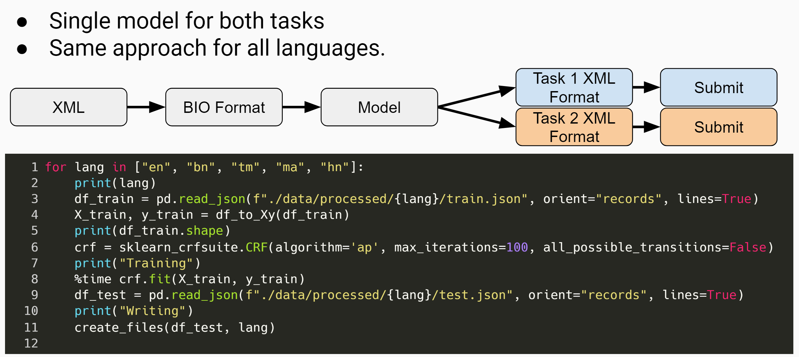

# EDNIL2020
Submission titled **Non-neural Structured Prediction for Event Detection from News in Indian Languages** for [EDNIL 2020 - Event Detection from News in Indian Languages](https://ednilfire.github.io/ednil/2020/index.html)

Citation

> Shubhanshu Mishra, Non-neural Structured Prediction for Event Detection from News in Indian Languages, in: P. Mehta, T. Mandl, P. Majumder, M. Mitra (Eds.), Working Notes of FIRE 2020 - Forum for Information Retrieval Evaluation, Hyderabad, India, December 16-20, 2020, CEUR Workshop Proceedings, CEUR-WS.org, 2020

## Approach

* Model both tasks as a single Sequence Tagging task
* Convert the data into the right format
* Model: N-gram + Regex features → CRF
* Post-process single model predictions for each task submission

## Results

* Our approach performed best across all languages and across all tasks. 
* The margin compared to the next best team was often >15% F1-score. 

